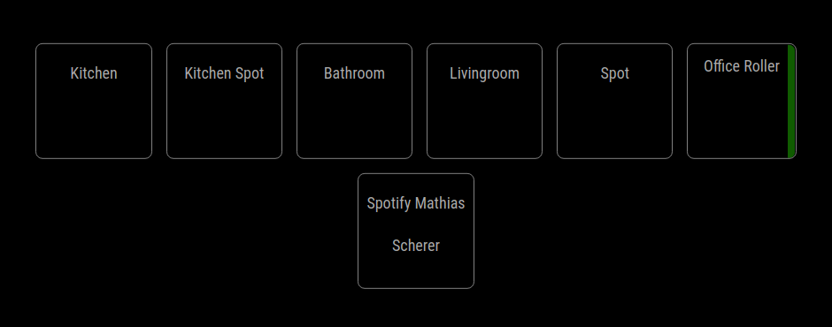
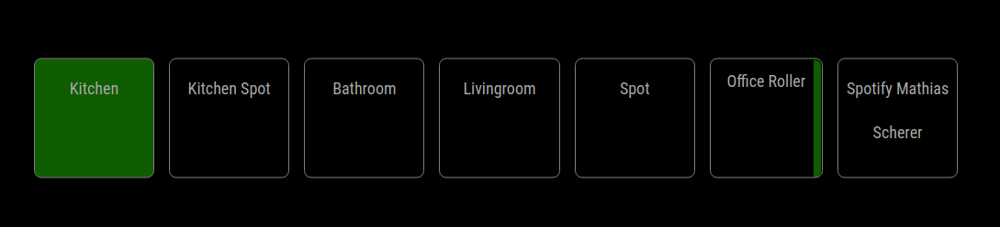
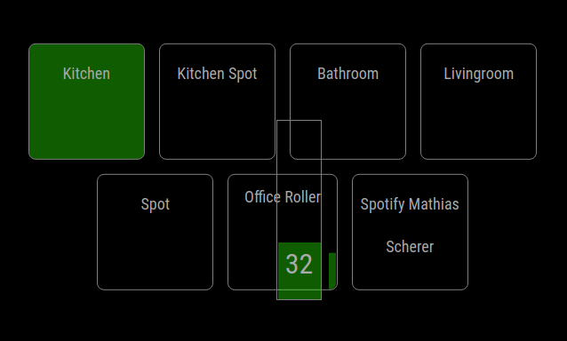

# MMM-HomeAssistant-Touch

This module provides an integration to HomeAssitant with touch controls.
It also supports multiple HomeAssistant hosts and connections. You can achieve this by adding the module multiple times to the config.js with different configurations

Currently, the following modules are supported:

- Cover
- Media Player
- Switch
- Light

## Connection

This module communicates via Rest API with HomeAssistant and registers websocket listeners for state updates.
You need a so called "Long Lived Access Token" for this module to work.  
You can obtain this token from the Homeassistant Webinterface in the "Account Profile" section:  
https://www.home-assistant.io/docs/authentication/#your-account-profile


## Config

These are the possible configuration options and the default values set by the module.

```javascript
{
    host: "http://127.0.0.1",
    port: 8123,
    token: "NOT_VALID",
    ignoreCert: false,
    entities: ["ENTITY_ID"],
}
```

## Screenshots




